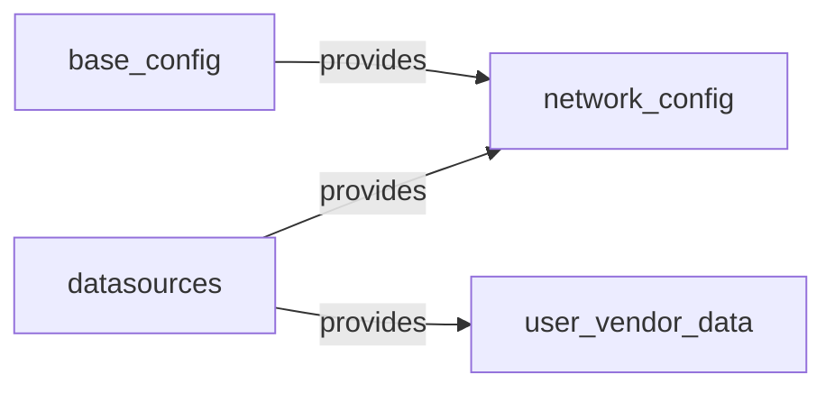

# Introduction

Cloud-init est un outil d'initialisation d'instances développé par Canoncial. Il permet la configuration des paramètres de base (hostname, réseau, utilisateurs) d'une image (template VMWare, image d'instance EC2, etc.).

Cela permet d'avoir une VM prête à l'emploi pour la configuration finale. Ainsi le périmètre de cloud-init est assez large en allant de la configuration réseau jusqu'aux packages en passant par les utilisateurs. Une liste plus exhaustive se trouve ici : [Module reference - coud-init documentation](https://cloudinit.readthedocs.io/en/latest/reference/modules.html).


Cette documentation à pour objectif de vulgariser le fonctionnement de cloud-init. Elle peut être utile pour avoir une vue simplifié avant l'étude de la documentation officielle : https://cloudinit.readthedocs.io/.

# Fonctionnement
Pour assurer l'initialisation d'une instance, Cloud-Init va intervenir à différente phase du démarrage. On identifie 5 phases :
1. Generator
2. Local
3. Network
4. Config
5. Final

- [Boot stages - cloud-init documentation](https://cloudinit.readthedocs.io/en/latest/explanation/boot.html)
{.links-list}

## Generator
Lorsque le système utilise [systemd](/systemd), ce dernier exécutera le script [cloud-init-generator](https://github.com/dmsimard/cloud-init/blob/master/systemd/cloud-init-generator) qui permet de générer la target *cloud-init.target*

### Voir aussi :
- [systemd.unit](/systemd/unit)
- [systemd.generator](/systemd/unit/generator)
- [systemd.target](/systemd/unit/target)
{.links-list}

## Local
| --- | --- |
| systemd service | cloud-init-local.service |
| runs | as soon as possible with / mounted read-write |
| blocks | as much of boot as possible, must block network |
| objectif | déterminer le *datasource* et appliquer la configuration réseau |  
A compléter

## 

## Résumé
A compléter

Le fonctionnement de cloud-init peut être résumé ainsi :



# Sources de configurations
Cloud-init va générer une configuration unique à partir de différentes sources. Le choix de la source doit se faire en fonction du besoin, notamment si l'on est plutôt un *utilisateur final*, un *développeur de distribution* ou un *fournisseur cloud*.

- [Specifying configuration - cloud-init documentation](https://cloudinit.readthedocs.io/en/latest/explanation/configuration.html#specifying-configuration)
{.links-list}

## Configuration de base
Dans la configuration de base on trouve (du moins prioritaire au plus prioritaire) :
1. **La configuration codé en dur** que l'on ne peut pas modifier.
2. **Les fichiers de configuration** défini par `/etc/cloud/cloud.cfg` et `/etc/cloud/cloud.cfg.d/`
3. **La configuration d'exécution (runtime config)** : défini par `/run/cloud-init/cloud.cfg`
4. **Ligne de commande du noyau** : sur la ligne de commande du noyau, tout ce qui se trouve entre `cc:` et `end_cc` sera interprété comme des données utilisateur cloud-config.

De façon général ce type de source est défini par le créateur de l'image (ex: *un développeur de distribution*). Elle est adaptée à la configuration de cloud-init tel que la liste des *datasources* supportés, le logging, les locales, etc. En bref, des paramètres qui régissent le comportement de cloud-init et qui ne devront pas être modifiés d'un clone de l'image à l'autre.

- [base configuration - cloud-init documentation](https://cloudinit.readthedocs.io/en/latest/explanation/configuration.html#base-configuration)
{.links-list}

## Les user-data et vendor-data

Les *user-data* et *vendor-data* sont fournis par les *datasources*. A l'usage, c'est cette source de configuration que l'on manipulera, puisque c'est celle qui est modifiable après le clone d'un template.

## La configuration réseau
La configuration réseau est indépendante des sources de configuration vu précédemment. Elle peut même être désactiver en spécifiant la configuration suivante dans la configuration de base :

```yaml
network:
  config: disabled
```

La configuration réseau peut se faire dans la configuration de base ou à via les *datasources*.

- [Network configuration - cloud-init documentation](https://cloudinit.readthedocs.io/en/latest/reference/network-config.html)
{.links-list}

# Les datasources

Après en avoir parler plusieurs fois, le temps est venu d'en parler. Les Datasources est ce qui rend cloud-init puissant ! C'est grâce à eux que la configuration des [User et vendor data](#les-user-data-et-vendor-data) peut être défini avant le boot de l'image.


Il en existe de très nombreux comme VMWare, OVF, NoCloud, Azure, Amazon EC2 et plein d'autres (la liste complète : https://cloudinit.readthedocs.io/en/latest/reference/datasources.html).


Il faut être vigilent sur la version de cloud-init qui tourne sur l'image, car des datasources sont ajoutés régulièrement. Par exemple la datasource VMWare n'est arrivé qu'en 21.3 tandis que la datasource OVF supporte la configuration du réseau que dans la 21.4. (CentOS 7 tourne avec la 19.4 !) 


Dans la suite de la documentation nous allons décrire la création d'une image (Template VMWare) à l'aide de la Datasource NoCloud qui permet de fournir les user-data soit par un ISO attaché à la VM, soit par une commande kernel ou enfin par le positionnement des fichiers dans `/var/lib/cloud/seed/cloud-net/`. C'est la datasource la plus flexible qui permet de s'adapter à n'importe quel provider (VMWare, Nutanix, Proxmox, etc.)

# Commandes
## Effacer la configuration cloud-init
```bash
cloud-init clean
```

## Lancer la configuration cloud-init
```
cloud-init init
```

# Références
- [cloud-init documentation](https://cloudinit.readthedocs.io/)
- [canonical/cloud-init - Github](https://github.com/canonical/cloud-init)
{.links-list}
